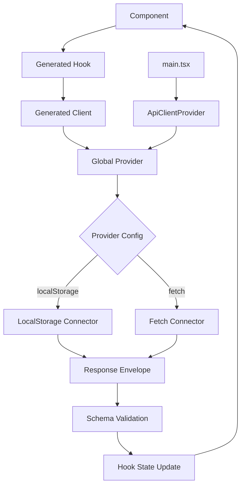

# Arquitectura Técnica

## 🌐 Provider Global

### ApiClientProvider
```typescript
interface ApiClientProviderProps {
  connector: 'localStorage' | 'fetch';
  config?: ConnectorConfig;
  children: React.ReactNode;
}

// Configuración única para toda la app
<ApiClientProvider connector="localStorage" config={{ simulateDelay: 300 }}>
  <App />
</ApiClientProvider>
```

### Context de Conector
```typescript
interface ApiClientContext {
  connector: IConnector;
  config: ConnectorConfig;
}

// Hook para acceder al conector global
const useApiConnector = () => useContext(ApiClientContext);
```

## 🔌 Sistema de Conectores

### Interface Base
```typescript
interface IConnector {
  get<T>(endpoint: string, params?: Record<string, any>): Promise<ApiResponse<T>>;
  post<T>(endpoint: string, data?: any): Promise<ApiResponse<T>>;
  put<T>(endpoint: string, data?: any): Promise<ApiResponse<T>>;
  delete<T>(endpoint: string): Promise<ApiResponse<T>>;
}
```

### LocalStorage Connector
- **Propósito**: Desarrollo y prototipado
- **Persistencia**: Browser localStorage
- **Simulación**: Delays artificiales, errores configurables
- **Datos**: JSON serializado con claves por endpoint

### Fetch Connector  
- **Propósito**: Producción con APIs reales
- **Transporte**: HTTP/HTTPS
- **Configuración**: Instancia personalizada, headers globales, interceptors
- **Manejo**: Errores HTTP, timeouts, retry logic, validaciones custom

## 🏭 Factory Genérico de APIs de Dominio

### Interface del Factory
```typescript
interface DomainApiConfig {
  entity: string;           // Nombre de la entidad (ej: 'users')
  schema: TSchema;          // Esquema principal de la entidad
  createSchema?: TSchema;   // Esquema para CREATE (opcional)
  updateSchema?: TSchema;   // Esquema para UPDATE (opcional)
  listSchema?: TSchema;     // Esquema para lista (opcional, usa schema por defecto)
  customOperations?: Record<string, CustomOperation>; // Operaciones adicionales
  interceptors?: DomainInterceptors; // Interceptors específicos del dominio
  pagination?: PaginationConfig;     // Configuración de paginación
}

// Factory genérico - no define dominios específicos
export const createDomainApi = <T extends TSchema>(config: DomainApiConfig) => {
  const { connector } = useApiConnector();
  return generateDomainHooks(config, connector);
};
```

### Operaciones CRUD Estándar
```typescript
// Operaciones generadas automáticamente (si el schema está presente)
interface GeneratedCrudApi<T> {
  // GET /users - Lista paginada
  useList?: () => UseQueryResult<PaginatedResponse<T[]>>;
  
  // GET /users/:id - Por ID
  useById?: (id: string) => UseQueryResult<T>;
  
  // POST /users - Crear
  useCreate?: () => UseMutationResult<T, CreateInput>;
  
  // PUT /users/:id - Actualizar completo
  useUpdate?: (id: string) => UseMutationResult<T, UpdateInput>;
  
  // DELETE /users/:id - Eliminar
  useDelete?: (id: string) => UseMutationResult<void>;
}
```

### Mapeo REST Estándar
```typescript
// La librería traduce operaciones CRUD a endpoints REST
const restMapping = {
  list:   { method: 'GET',    endpoint: '/{entity}' },
  byId:   { method: 'GET',    endpoint: '/{entity}/{id}' },
  create: { method: 'POST',   endpoint: '/{entity}' },
  update: { method: 'PUT',    endpoint: '/{entity}/{id}' },
  delete: { method: 'DELETE', endpoint: '/{entity}/{id}' }
};

// Ejemplos para entidad 'users':
// useUsers()     -> GET /users
// useUser(id)    -> GET /users/123
// useCreateUser() -> POST /users
// useUpdateUser(id) -> PUT /users/123
// useDeleteUser(id) -> DELETE /users/123
```

### Proceso de Generación
1. **Análisis de Esquemas CRUD**: Determina qué operaciones generar
2. **Inyección del Provider**: Usa el conector global configurado
3. **Mapeo REST**: Traduce operaciones a endpoints HTTP estándar
4. **Validación Estricta**: Input/Output con TypeBox
5. **Wrapping**: Envelope de respuesta estándar

## 📊 Esquemas de Respuesta

### Success Response
```typescript
interface SuccessResponse<T> {
  success: true;
  message?: string;
  data: T;
  meta?: {
    total: number;
    page: number;
    limit: number;
    totalPages: number;
  };
}
```

### Error Response
```typescript
interface ErrorResponse {
  success: false;
  error?: { code: string };
  message?: string;
  type?: 'AUTH' | 'VALIDATION' | 'TRANSACTION' | 'NAVIGATION';
  validation?: Record<string, string>;
}
```

## 🎣 Sistema de Hooks

### Hook Base Simplificado
```typescript
// Query Hook (GET)
interface UseQueryHook<T> {
  data: T | null;
  loading: boolean;
  error: ErrorResponse | null;
  refetch: () => Promise<void>;
}

// Mutation Hook (POST/PUT/DELETE)
interface UseMutationHook<TInput, TOutput = void> {
  mutate: (input: TInput) => Promise<TOutput>;
  loading: boolean;
  error: ErrorResponse | null;
}
```

### Interceptors por Dominio
```typescript
interface DomainInterceptors {
  request?: (config: RequestConfig, operation: CrudOperation) => RequestConfig;
  response?: (response: ApiResponse, operation: CrudOperation) => ApiResponse;
  error?: (error: ErrorResponse, operation: CrudOperation) => ErrorResponse | void;
}

// Ejemplo de uso con interceptors
const userApi = createDomainApi({
  entity: 'users',
  schema: UserSchema,
  createSchema: CreateUserSchema,
  updateSchema: UpdateUserSchema,
  interceptors: {
    request: (config, operation) => {
      // Lógica específica para requests de usuarios
      if (operation === 'create') {
        config.headers['X-User-Creation'] = 'true';
      }
      return config;
    },
    error: (error, operation) => {
      if (error.code === 'USER_NOT_FOUND' && operation === 'byId') {
        // Manejo específico de error de usuario no encontrado
        return { ...error, message: 'Usuario no existe' };
      }
    }
  }
});
```

### Configuración de Paginación
```typescript
interface PaginationConfig {
  defaultLimit?: number;
  maxLimit?: number;
  defaultPage?: number;
}

// Configuración global (en provider)
<ApiClientProvider 
  connector="fetch" 
  config={{ 
    baseUrl: '/api',
    pagination: { defaultLimit: 20, maxLimit: 100 }
  }}
>

// Override por dominio
const userApi = createDomainApi({
  entity: 'users',
  schema: UserSchema,
  pagination: { defaultLimit: 10 } // Override para usuarios
});
```

## 🔄 Flujo de Datos



## 🛡️ Validación y Tipos

### Input Validation
- Validación en cliente antes de envío
- Mensajes de error descriptivos
- Integración con formularios

### Output Validation
- Validación de respuestas del servidor
- Type safety garantizado
- Fallbacks para datos inválidos

## 🔧 Configuración

### Provider Config
```typescript
interface ConnectorConfig {
  // Para Fetch Connector
  baseUrl?: string;
  headers?: Record<string, string>;
  timeout?: number;
  retries?: number;
  fetchInstance?: FetchInstance;  // Instancia personalizada
  
  // Para LocalStorage Connector
  simulateDelay?: number;
  errorRate?: number;
  
  // Configuración global
  errorHandling?: 'throw' | 'return';
  caching?: boolean;
  devMode?: boolean;
}

// Instancia personalizada de Fetch
interface FetchInstance {
  baseURL: string;
  headers: Record<string, string>;
  interceptors: {
    request: RequestInterceptor[];
    response: ResponseInterceptor[];
  };
  timeout?: number;
  retries?: number;
}

type RequestInterceptor = (config: RequestConfig) => RequestConfig | Promise<RequestConfig>;
type ResponseInterceptor = (response: Response) => Response | Promise<Response>;
```

### Configuración por Entorno
```typescript
// config/api.dev.ts
export const devConfig: ConnectorConfig = {
  simulateDelay: 300,
  errorRate: 0.1,
  devMode: true
};

// config/api.prod.ts - Configuración básica
export const prodConfig: ConnectorConfig = {
  baseUrl: process.env.REACT_APP_API_URL,
  timeout: 10000,
  retries: 3,
  headers: {
    'Content-Type': 'application/json',
    'X-API-Version': 'v1'
  }
};

// config/api.prod.ts - Con instancia personalizada
const customFetchInstance: FetchInstance = {
  baseURL: process.env.REACT_APP_API_URL!,
  headers: {
    'Content-Type': 'application/json',
    'X-API-Version': 'v1',
    'X-Client': 'react-app'
  },
  interceptors: {
    request: [
      // Agregar token automáticamente
      (config) => {
        const token = localStorage.getItem('authToken');
        if (token) {
          config.headers.Authorization = `Bearer ${token}`;
        }
        return config;
      },
      // Log de requests
      (config) => {
        console.log('API Request:', config.method, config.url);
        return config;
      }
    ],
    response: [
      // Validar respuestas
      (response) => {
        if (response.status === 401) {
          // Redirect a login
          window.location.href = '/login';
        }
        return response;
      },
      // Log de responses
      (response) => {
        console.log('API Response:', response.status, response.url);
        return response;
      }
    ]
  },
  timeout: 15000,
  retries: 3
};

export const prodConfigAdvanced: ConnectorConfig = {
  fetchInstance: customFetchInstance
};
```
