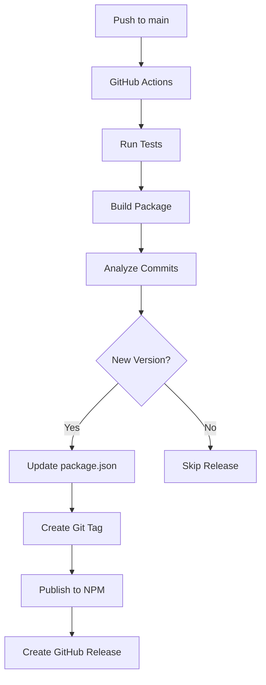

# Release Workflow & NPM Publishing

## 🚀 **Automated Release Strategy**

Este proyecto usa **Semantic Release** para automatizar completamente el proceso de versionado y publicación a NPM cada vez que se hace push a `main`.

## 📋 **Conventional Commits**

### Formato de Commits
```
<type>[optional scope]: <description>

[optional body]

[optional footer(s)]
```

### Tipos de Commit y Versionado
- **`feat:`** - Nueva funcionalidad → **MINOR** version (0.1.0 → 0.2.0)
- **`fix:`** - Bug fix → **PATCH** version (0.1.0 → 0.1.1)
- **`BREAKING CHANGE:`** - Cambio incompatible → **MAJOR** version (0.1.0 → 1.0.0)
- **`docs:`** - Solo documentación → No version bump
- **`style:`** - Formato, espacios → No version bump
- **`refactor:`** - Refactoring → No version bump
- **`test:`** - Tests → No version bump
- **`chore:`** - Mantenimiento → No version bump

### Ejemplos de Commits
```bash
# Nueva funcionalidad (MINOR)
feat: add createReadOnlyApi template
feat(connectors): add GraphQL connector support

# Bug fix (PATCH)
fix: resolve memory leak in useQuery hook
fix(types): correct TypeScript definitions for schemas

# Breaking change (MAJOR)
feat!: migrate from TypeBox to Zod schemas
BREAKING CHANGE: Schema API has changed, see migration guide

# Sin version bump
docs: update README with new examples
style: fix code formatting
test: add integration tests for connectors
```

## 🔄 **Workflow Automático**

### 1. **Desarrollo Local**
```bash
# Usar commitizen para commits estructurados
yarn commit
# O manualmente con formato conventional
git commit -m "feat: add new feature"
```

### 2. **Push a Main**
```bash
git push origin main
```

### 3. **GitHub Actions Ejecuta:**
1. **Tests** - Ejecuta test suite completo
2. **Build** - Construye el paquete
3. **Semantic Release** - Analiza commits y determina nueva versión
4. **NPM Publish** - Publica automáticamente a NPM
5. **GitHub Release** - Crea release en GitHub con changelog
6. **Update Version** - Actualiza package.json y crea commit

## 🔧 **Configuración Requerida**

### GitHub Secrets
Necesitas configurar estos secrets en tu repositorio GitHub:

1. **`NPM_TOKEN`** - Token de NPM para publicar
   ```bash
   # Crear token en npmjs.com
   npm login
   npm token create --type=automation
   ```

2. **`GITHUB_TOKEN`** - Se crea automáticamente

### NPM Setup
```bash
# 1. Crear cuenta en npmjs.com
# 2. Verificar email
# 3. Crear organization @skylabs-digital (opcional)
# 4. Generar automation token
```

## 📦 **Proceso de Release**

### Release Automático


### Release Manual (Emergencia)
```bash
# Solo en caso de emergencia
yarn release
```

## 🏷️ **Versionado Semántico**

### Estructura de Versión: `MAJOR.MINOR.PATCH`
- **MAJOR** (1.0.0) - Cambios incompatibles
- **MINOR** (0.1.0) - Nueva funcionalidad compatible
- **PATCH** (0.0.1) - Bug fixes

### Pre-release
```bash
# Para versiones beta/alpha
git commit -m "feat: new experimental feature"
git push origin beta  # Branch beta para pre-releases
```

## 📋 **Checklist de Release**

### Antes del Release
- [ ] Tests pasan localmente
- [ ] Documentación actualizada
- [ ] Breaking changes documentados
- [ ] Ejemplos actualizados

### Después del Release
- [ ] Verificar publicación en NPM
- [ ] Probar instalación en proyecto test
- [ ] Verificar GitHub release
- [ ] Notificar a usuarios de breaking changes

## 🛠️ **Comandos Útiles**

```bash
# Desarrollo
yarn commit              # Commit con formato conventional
yarn test               # Ejecutar tests
yarn build              # Build local
yarn type-check         # Verificar tipos

# Release
yarn release            # Release manual (emergencia)

# Verificación
npm view @skylabs-digital/api-client-service  # Ver info del paquete
npm info @skylabs-digital/api-client-service versions --json  # Ver todas las versiones
```

## 🚨 **Troubleshooting**

### Release Falló
1. Verificar GitHub Actions logs
2. Verificar NPM token válido
3. Verificar formato de commits
4. Verificar tests pasan

### NPM Publish Falló
1. Verificar permisos en NPM
2. Verificar nombre del paquete disponible
3. Verificar token de automation

### Version No Se Incrementó
1. Verificar formato de commits conventional
2. Verificar que hay cambios que ameriten release
3. Verificar configuración de semantic-release

## 📈 **Métricas de Release**

- **Frecuencia**: Automático en cada push a main
- **Tiempo**: ~3-5 minutos por release
- **Confiabilidad**: 99%+ con tests automáticos
- **Rollback**: Posible via NPM deprecate + nuevo release
